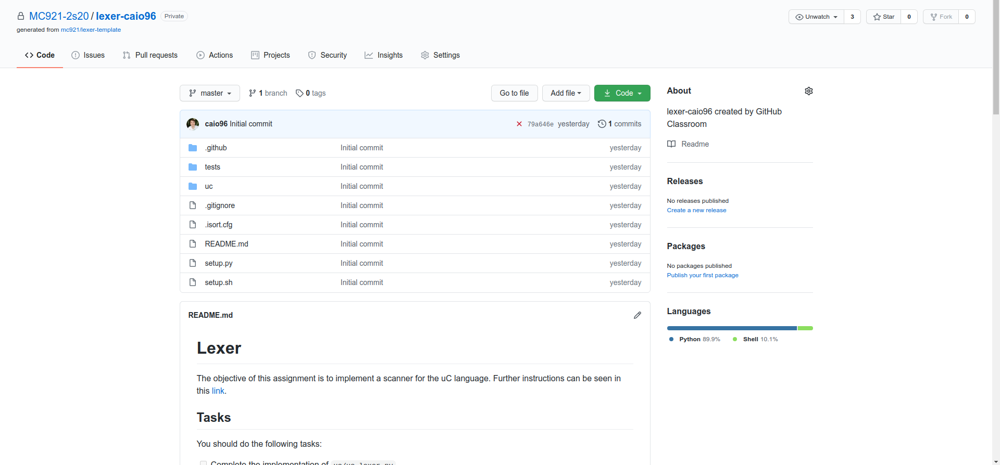
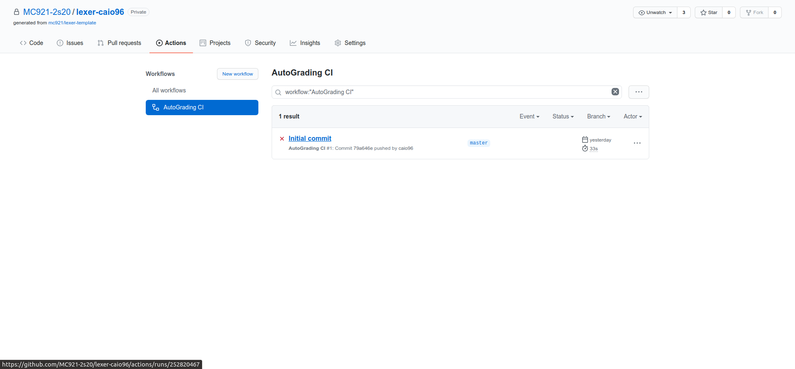
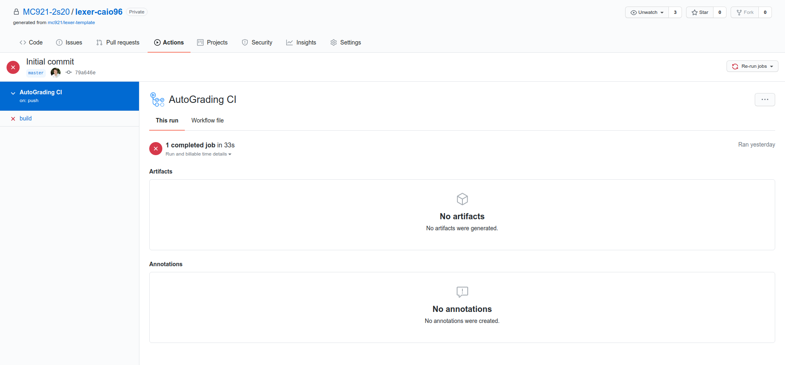
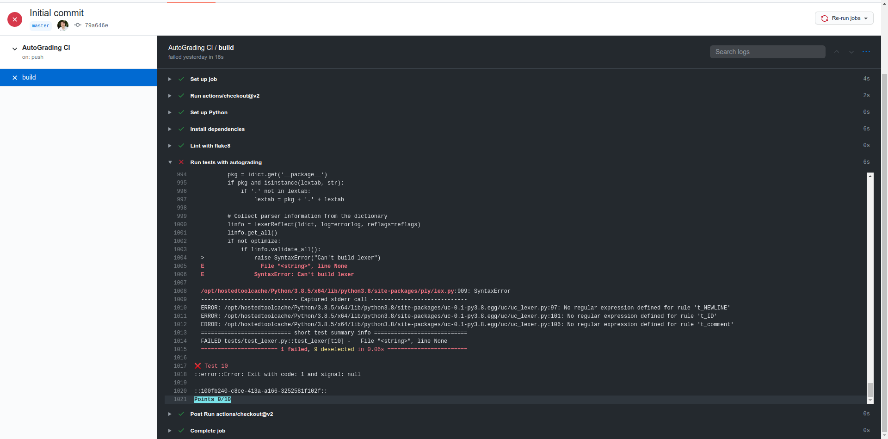

GitHub Actions
================================================================================

In this course, the students will be assigned programming tasks
which should be delivered via GitHub Classroom. The students can evaluate their
solutions on their own machines or take advantage of the GitHub Actions
infrastructure. With GitHub Actions, whenever the student pushes commits back to
their repositories an automated routine will be triggered, which will download
the student's repository and test it. By looking at the Action logs,
it is possible to determine the program output.

**Important:** The GitHub Actions infrastructure exists solely for the
convenience of the students, but it will not be used for grading the
assignments. The actual grading will be done using an automated solution
available only to the instructors and TAs in order to prevent cheating.

How to use it
--------------------------------------------------------------------------------

In your repository, click the "Actions" tab at the top bar.

This page lists all the workflow runs. Notice on the left panel the "AutoGrading CI" workflow. 
On the center panel, you can observe the runs (only one in this case). Some useful information is shown for each run: commit hash, who pushed it, to which branch, etc. 
Every time you push commits to your repo, a new run will automatically start.

If you click in some of the runs, you will be greeted with the following page.
We know this run failed because of the red cross mark on the top.
You can observe the jobs in the left panel, in this case only one named 'build'.

If you select the "build" job, you can read the log for each step. 
A green checkmark means that the step succeeded and a red cross means that the step failed. 
Click on the step to read its output.

Finally, if you select one of the "Run with autograding" step, you can see all the tests being executed. 
It should be easy to see which test failed and which succeeded.
Both the GitHub Actions infrastructure and our internal grading script require the output of your program to be exactly like the original version, otherwise, the "Compare Results" step will fail and you will **not** receive a grade.

If you have any further questions, you can contact one of the TAs via email or Google Classroom.
